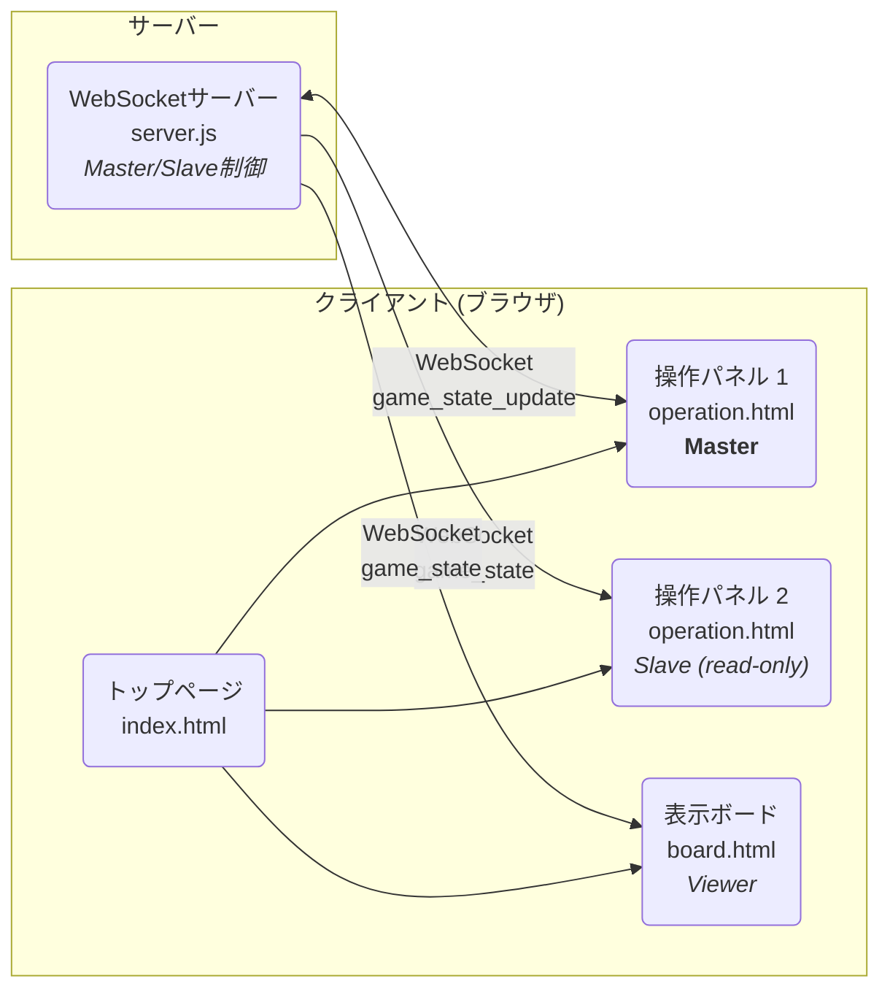

# 野球中継スコアボード (Baseball Broadcast Board)

YouTube 等のライブ配信で野球の試合を中継する際に、OBS のような配信ソフトウェアにスコアボード画面をクロマキー合成で表示するためのアプリケーションです。


## 主な機能

- **リアルタイム更新**: 操作パネルから入力した内容が、WebSocket を通じて即座に表示ボードへ反映されます。
- **状態の永続化**: 試合状況がサーバー側に自動保存され、ブラウザのリフレッシュやサーバー再起動後も試合を継続できます。
- **シンプルな操作画面**: Web ブラウザから誰でも簡単に試合状況（スコア、イニング、SBO カウント、ランナー情報）を更新できます。
- **OBS 連携**: 表示ボードは背景が緑色になっており、OBS などの配信ソフトウェアで簡単にクロマキー合成できます。
- **マルチPC対応**: サーバーのIPアドレスを指定することで、別のPCから操作パネルと表示ボードにアクセス可能です。
- **設定自動生成**: コマンドラインツールで`init_data.json`を簡単に生成できます（インタラクティブモード、YAML、コマンドライン引数の3つの方法に対応）。

## システム構成

トップページ(`index.html`)から、操作パネル(`operation.html`)と表示ボード(`board.html`)へアクセスします。操作パネルと表示ボードは、WebSocket サーバー(`server.js`)を介してリアルタイムに通信します。



## 主要ファイル構成

```
.
├── public/                 # 静的ファイル（Webサーバーが配信）
│   ├── index.html          # トップページ（メニュー）
│   ├── operation.html      # 操作パネルのUI
│   ├── board.html          # OBS等で表示するスコアボード画面
│   ├── css/
│   │   ├── main.css        # カスタムスタイル
│   │   └── bootstrap.min.css   # Bootstrap CSS (npm経由で自動生成)
│   ├── js/
│   │   ├── Scoreboard.js   # Vue.jsのスコアボードコンポーネント
│   │   ├── main.js         # 操作パネルのVue.jsアプリケーション
│   │   ├── board.js        # 表示ボードのVue.jsアプリケーション
│   │   ├── vue.global.js   # Vue.js (npm経由で自動生成)
│   │   └── bootstrap.bundle.min.js  # Bootstrap JS (npm経由で自動生成)
│   └── img/                # 画像ファイル
├── scripts/                # ビルド・ユーティリティスクリプト
│   ├── copy-deps.js        # npm依存関係をpublic/にコピーするスクリプト
│   └── generate-init-data.js  # init_data.json生成ツール
├── config/                 # 設定ファイル
│   ├── init_data.json      # 大会名・チーム名の初期設定ファイル
│   └── config.yaml.example # YAML設定ファイルのサンプル
├── data/                   # 実行時データ
│   └── current_game.json   # 試合状況の保存ファイル（自動生成）
├── logs/                   # ログファイル
│   ├── pm2-error.log       # PM2エラーログ（自動生成）
│   └── pm2-out.log         # PM2標準出力ログ（自動生成）
├── ecosystem.config.js     # PM2設定ファイル
├── server.js               # WebサーバーとWebSocketサーバー
├── package.json            # プロジェクト情報と依存ライブラリ
└── doc/                    # ドキュメントや画像
```

## 技術スタック

- **フロントエンド**:
  - HTML5 / CSS3
  - Bootstrap 5
  - Vue.js 3
- **バックエンド**:
  - Node.js
  - ws (WebSocket ライブラリ)
  - js-yaml (YAML パーサー)

## セットアップと実行方法

**前提条件**: [Node.js](https://nodejs.org/)と npm がインストールされていること。

1.  **依存関係のインストール**:
    プロジェクトのルートディレクトリで以下のコマンドを実行します。

    ```bash
    npm install
    ```

    このコマンドにより、以下が自動的に実行されます:
    - 必要なnpmパッケージ（Bootstrap、Vue.js、ws、js-yamlなど）のインストール
    - `postinstall`フックによる依存ファイルの自動コピー（Bootstrap CSS/JS、Vue.jsを`css/`と`js/`ディレクトリへ）

2.  **サーバーの起動**:
    サーバーは「開発モード」と「本番モード」の 2 つのモードで実行できます。

    - **開発モード（ログ出力あり）**
      ターミナルにデバッグ用のログが出力されます。

      ```bash
      node server.js
      ```

      コンソールに`Server is listening on port 8080`などのメッセージが表示されれば成功です。

    - **本番モード（ログ出力なし）**
      本番の配信などでログを非表示にする場合は、`NODE_ENV`環境変数を`production`に設定して起動します。
      ```bash
      NODE_ENV=production node server.js
      ```

3.  **アプリケーションの使用**:

    - **トップページ**: `http://localhost:8080/` または `http://localhost:8080/index.html` にアクセスします。
      
    - **操作パネル**: `http://localhost:8080/operation.html` にアクセスします。
      
       
    - **表示ボード**: `http://localhost:8080/board.html` にアクセスします。この URL を OBS 等のブラウザソースに設定してください。

4.  **サーバーの停止**:
    サーバーを起動したターミナルで `Ctrl + C` を押すと停止します。

## マルチPC構成での使用方法

別のPCから操作パネルや表示ボードにアクセスする場合:

1. **サーバーのIPアドレスを確認**:

   サーバーを起動しているPCで以下のコマンドを実行します:

   ```bash
   # Linux/Mac
   hostname -I

   # Windows
   ipconfig
   ```

2. **別のPCからアクセス**:

   `localhost` をサーバーのIPアドレスに置き換えてアクセスします:

   ```
   http://192.168.1.100:8080/             # トップページ
   http://192.168.1.100:8080/operation.html  # 操作パネル
   http://192.168.1.100:8080/board.html      # 表示ボード
   ```

3. **OBSでの設定**:

   - OBSで「ソース」→「追加」→「ブラウザ」を選択
   - URLに表示ボードのアドレスを入力: `http://192.168.1.100:8080/board.html`
   - クロマキー合成で緑色を抜く

WebSocket接続は、アクセスしたURLのホスト名を自動的に使用するため、追加の設定は不要です。

**⚠️ 注意: 複数人での同時操作について**

複数の端末から`operation.html`に同時にアクセスした場合、最初に接続した端末のみが操作可能（Master）となり、後から接続した端末は閲覧専用（Slave）となります。詳細は[Master/Slave Operation Control](#masterslave-operation-control)セクションをご覧ください。

## マスター/スレーブ操作制御

### 概要

複数のユーザーが操作パネルに同時にアクセスする場合の競合を防ぐため、マスター/スレーブアーキテクチャを実装しています:

- **マスター**: 最初に `operation.html` に接続したクライアントがマスターとなり、完全な操作権限を持ちます
- **スレーブ**: 後から接続したクライアントはスレーブとなり、閲覧専用となります
- **自動昇格**: マスターが切断されると、最も古いスレーブが自動的にマスターに昇格します
- **手動解放**: マスターは自発的に操作権限を解放し、他のユーザーに引き継ぐことができます

### アーキテクチャ

#### サーバー側のロール管理 (server.js)

サーバーは接続中のすべてのクライアントとそのメタデータをマップで管理します:

```javascript
const clients = new Map(); // Map<clientId, {ws, type, role, connectedAt}>
let masterClientId = null;
```

**主要コンポーネント:**

1. **クライアント識別** (62-68行目):
   - 各WebSocket接続には一意のID `client_${counter}_${timestamp}` が割り当てられます
   - クライアントタイプはハンドシェイクメッセージで判別されます

2. **ロール割り当て** (147-190行目):
   - 操作クライアント: 最初の接続 → マスター、それ以降 → スレーブ
   - ボードクライアント: 常にビューアーロールを割り当て
   - ハンドシェイクタイムアウト (3秒): ハンドシェイクなしのクライアントはボードとして扱われます

3. **メッセージフィルタリング** (210-229行目):
   - マスターのみが `game_state_update` メッセージを送信可能
   - マスター以外からの更新はログに記録され、拒否されます
   - すべてのクライアントはブロードキャストされた試合状態の更新を受信します

4. **昇格アルゴリズム** (93-114行目):
   - マスター切断時、すべての操作スレーブを検索
   - 接続時刻でソート（最古優先）
   - 最も古いスレーブをマスターに昇格
   - `role_changed` 通知を送信

#### クライアント側のロール管理 (public/js/main.js)

**状態変数** (30-32行目):
```javascript
clientRole: null,  // null | 'master' | 'slave'
clientId: null,
masterClientId: null,
```

**主要機能:**

1. **ハンドシェイク** (115-119行目):
   - 接続時に `{type: 'handshake', client_type: 'operation'}` を送信
   - 操作クライアント（ボードと区別）として識別

2. **ロールメッセージの処理** (127-152行目):
   - `role_assignment`: サーバーからの初期ロール
   - `role_changed`: ロール更新（昇格または降格）
   - `game_state`: 他のクライアントからの状態更新

3. **UI制御** (89-96行目):
   - `isOperationDisabled` 算出プロパティはスレーブの場合にtrueを返す
   - すべての操作ボタンは `:disabled="isOperationDisabled"` を使用

4. **更新ゲート** (188-196行目):
   - `updateBoard()` は `clientRole === 'master'` の場合のみ更新を送信
   - スレーブが誤って状態変更を送信するのを防止

5. **手動解放** (337-349行目):
   - `releaseMasterControl()` メソッドは `release_master` メッセージを送信
   - マスターのみ利用可能
   - 確認ダイアログを表示

#### UI インジケーター (public/operation.html)

**ステータス表示** (180-202行目):
- 緑色バッジ: 👑 マスター (操作可能)
- 黄色バッジ: 👁️ スレーブ (閲覧専用)
- 視認性のためナビゲーションバーに表示

**スレーブ警告バナー** (208-217行目):
- ロールがスレーブの場合、ページ上部にアラートボックスを表示
- 閲覧専用状態を説明
- 自動昇格について通知

**マスター制御カード** (366-380行目):
- `clientRole === 'master'` の場合のみ表示
- 解放ボタンを含む
- 簡単にアクセスできるよう右列に配置

### メッセージプロトコル

#### クライアント → サーバー メッセージ

**ハンドシェイク**:
```json
{
  "type": "handshake",
  "client_type": "operation" | "board"
}
```

**試合状態更新** (マスターのみ):
```json
{
  "type": "game_state_update",
  "data": {
    "game_title": "...",
    "team_top": "...",
    "game_inning": 1,
    ...
  }
}
```

**マスター解放**:
```json
{
  "type": "release_master"
}
```

#### サーバー → クライアント メッセージ

**ロール割り当て**:
```json
{
  "type": "role_assignment",
  "role": "master" | "slave" | "viewer",
  "clientId": "client_1_1234567890",
  "masterClientId": "client_0_1234567889"
}
```

**ロール変更**:
```json
{
  "type": "role_changed",
  "newRole": "master" | "slave",
  "reason": "master_disconnected" | "master_released"
}
```

**試合状態ブロードキャスト**:
```json
{
  "type": "game_state",
  "data": { ... }
}
```

### 操作フロー

#### 初回接続

```
1. クライアントがWebSocketに接続
2. クライアントがハンドシェイク {type: "handshake", client_type: "operation"} を送信
3. サーバーがマスターの存在を確認
   - マスターなし → ロール: "master" を割り当て、masterClientIdを設定
   - マスターあり → ロール: "slave" を割り当て
4. サーバーが role_assignment メッセージを送信
5. サーバーが現在の game_state を送信
6. クライアントがロールインジケーターを表示し、UIを有効/無効化
```

#### マスター切断

```
1. マスターのWebSocketが閉じる
2. サーバーが切断イベントを検出
3. サーバーが promoteNextMaster() を呼び出し
4. サーバーが connectedAt タイムスタンプで最も古いスレーブを検索
5. サーバーがスレーブのロールを "master" に更新
6. サーバーが新マスターに role_changed メッセージを送信
7. 新マスターがUI制御を有効化
```

#### 手動解放

```
1. マスターが「マスター権限を解放」ボタンをクリック
2. 確認ダイアログが表示される
3. 確定すると、クライアントが {type: "release_master"} を送信
4. サーバーが masterClientId = null に設定
5. サーバーが元マスターのロールを "slave" に変更
6. サーバーが promoteNextMaster() を呼び出し
7. サーバーが両方に role_changed を送信:
   - 元マスター (newRole: "slave")
   - 新マスター (newRole: "master")
8. UIが適切に更新される
```

### エッジケース

**同時接続**:
- レースコンディションはサーバー側の逐次処理で解決
- 最初に処理されたハンドシェイクがマスターロールを獲得

**ネットワーク中断**:
- 自動再接続が新しいWebSocket接続をトリガー
- クライアントは新規接続として扱われる（マスターだった場合でも失う）
- 再接続は以前のロールを復元しない

**複数のブラウザタブ**:
- 各タブは独立した接続
- 最初のタブのみがマスターとなる
- 同じデバイスからの他のタブはスレーブとなる

**ハンドシェイクタイムアウト**:
- 3秒以内にハンドシェイクを送信しないクライアントはボードとして扱われる
- 古いboard.htmlバージョンとの後方互換性を確保
- ボードクライアントには "viewer" ロールが割り当てられる（操作権限なし）

### 後方互換性

**ボードクライアント**:
- `board.html` はハンドシェイクを送信するように更新（board.js の72-76行目）
- ハンドシェイクなしの古いバージョンも動作（タイムアウト → ビューアー）
- ボードクライアントは操作マスター/スレーブロジックに干渉しない

**レガシー試合状態メッセージ**:
- `type` フィールドのないメッセージは試合状態更新として扱われる
- 古いクライアントコードとの互換性を維持
- サーバーチェック: `if (data.type === 'game_state_update' || !data.type)`

### テスト

**基本機能**:
```bash
# ターミナル 1: サーバー起動
node server.js

# ブラウザ 1: 操作パネルを開く
# 表示されるべき内容: 👑 マスター (操作可能)
open http://localhost:8080/operation.html

# ブラウザ 2: 別の操作パネルを開く
# 表示されるべき内容: 👁️ スレーブ (閲覧専用)
open http://localhost:8080/operation.html
```

**マスター昇格**:
1. ブラウザ 1 (マスター) を閉じる
2. ブラウザ 2 が自動的にマスターに昇格するはず
3. ナビゲーションバーでロール変更を確認

**手動解放**:
1. ブラウザ 1 がマスター、ブラウザ 2 がスレーブの状態で
2. ブラウザ 1 で「マスター権限を解放」をクリック
3. ダイアログを確認
4. ブラウザ 1 がスレーブに、ブラウザ 2 がマスターになる

**ネットワークログ**:
```bash
# 詳細ログを有効化
node server.js

# ログメッセージを確認:
# - Client connected: client_X_timestamp
# - Client client_X_timestamp registered as operation/master
# - Client client_Y_timestamp registered as operation/slave
# - Rejected update from non-master client client_Y_timestamp
# - Master client_X_timestamp released control
# - Client client_Y_timestamp promoted to master
```

### セキュリティ考慮事項

**現在の実装**:
- 認証なし: 任意のクライアントが接続可能
- マスターは接続順のみで決定
- 信頼できるローカルネットワークまたは単一ユーザーシナリオに適している

**将来の拡張案**:
- パスワード保護されたマスターアクセス
- IPベースのアクセス制御
- セッションベースのロール永続化
- 管理者オーバーライド機能

## 初期設定ファイルの生成

操作パネルを開いた際の初期値は `config/init_data.json` ファイルで設定します。このファイルは **自動生成ツール** を使って簡単に作成できます。

### 自動生成ツールの使い方

3つの方法で `init_data.json` を生成できます:

#### 1. インタラクティブモード（推奨）

対話形式で入力します:

```bash
npm run init
```

実行例:
```
大会名を入力してください [現在: 大会名]: 夏季大会
試合の最終イニングを入力してください [現在: 9]: 7
参加チーム名を入力してください [入力終了: enterのみ]:
  チーム 1: A
  チーム 2: B
  チーム 3: C
  チーム 4: D
  チーム 5: E

✓ 先攻チーム: A
✓ 後攻チーム: B
✓ init_data.json を生成しました
```

#### 2. YAMLファイルから生成

YAMLファイルを用意して生成します:

```bash
# サンプルファイルをコピー
cp config/config.yaml.example config/my-config.yaml

# 編集
nano config/my-config.yaml

# 生成
npm run init config/my-config.yaml
```

YAMLファイルの例（`config/my-config.yaml`）:
```yaml
game_title: 夏季大会
last_inning: 7
team_names:
  - A
  - B
  - C
  - D
  - E
```

#### 3. コマンドライン引数で生成

一行のコマンドで直接指定します:

```bash
npm run init -- -t "夏季大会" -i 7 --teams "A,B,C,D,E"
```

オプション:
- `-t, --title <string>`: 大会名（必須）
- `-i, --innings <number>`: 最終イニング（1-9、デフォルト: 9）
- `--teams <string>`: 参加チーム（カンマ区切り、必須、最低2チーム）
- `-h, --help`: ヘルプ表示

### 自動生成ルール

- **先攻チーム** (`team_top`): 参加チームの1番目
- **後攻チーム** (`team_bottom`): 参加チームの2番目
- **イニング配列** (`game_array`): `["試合前", 1, 2, ..., イニング数, "試合終了"]`
- **チーム選択肢** (`team_items`): `["　", チーム1, チーム2, ...]` ※先頭は全角スペース

### バリデーション

- 参加チーム数: 最低2チーム必要
- 最終イニング: 1から9の範囲

### バックアップ機能

既存の `config/init_data.json` がある場合、自動的に `config/init_data.json.bak` にバックアップされます。

### 生成される init_data.json の例

```json
{
  "game_title": "夏季大会",
  "team_top": "A",
  "team_bottom": "B",
  "game_array": ["試合前", 1, 2, 3, 4, 5, 6, 7, "試合終了"],
  "team_items": ["　", "A", "B", "C", "D","E"],
  "last_inning": 7
}
```

### 手動編集

もちろん、`config/init_data.json` を直接編集することも可能です。

- `game_title`: 大会名
- `team_top`: 先攻チーム
- `team_bottom`: 後攻チーム
- `game_array`: イニング選択プルダウンの選択肢
- `team_items`: チーム名選択プルダウンの選択肢（先頭は全角スペース）
- `last_inning`: 最終イニング

## 依存関係の管理

このプロジェクトでは、Bootstrap と Vue.js を npm 経由で管理しています。

### 依存ファイルの自動コピー

`npm install` を実行すると、`postinstall` フックにより `scripts/copy-deps.js` スクリプトが自動実行され、以下のファイルが `node_modules/` から静的ファイルディレクトリにコピーされます:

- `node_modules/bootstrap/dist/css/bootstrap.min.css` → `public/css/bootstrap.min.css`
- `node_modules/bootstrap/dist/js/bootstrap.bundle.min.js` → `public/js/bootstrap.bundle.min.js`
- `node_modules/vue/dist/vue.global.js` → `public/js/vue.global.js`

### 手動での依存ファイル更新

依存ファイルを手動で再コピーする場合は、以下のコマンドを実行します:

```bash
npm run build:deps
```

### 依存パッケージの更新

Bootstrap や Vue.js のバージョンを更新する場合:

1. `package.json` の依存バージョンを更新
2. `npm install` を実行（自動的に `copy-deps.js` が実行されます）

または、特定のパッケージを直接更新:

```bash
npm update bootstrap vue
```

## 状態の永続化

試合状況（スコア、イニング、BSO、ランナー等）はサーバー側で自動的に保存されます。

### 保存される情報

- 試合状況: `data/current_game.json` に自動保存
- 保存内容: スコア、イニング、表裏、BSO カウント、ランナー情報など

### 動作の詳細

1. **操作パネルでの変更**
   - スコアや BSO を変更すると、WebSocket 経由でサーバーに送信
   - サーバーが `data/current_game.json` に自動保存

2. **ブラウザをリフレッシュした場合**
   - 操作パネル、表示ボードともに最新の試合状況が復元される
   - 試合を中断せずに続行可能

3. **サーバーを再起動した場合**
   - サーバー起動時に `data/current_game.json` から状態を読み込み
   - 試合を中断した時点から再開可能

4. **試合途中で表示ボードを開いた場合**
   - サーバーが保持している最新の試合状況が即座に表示される
   - 操作パネルで何か操作する必要なし

### 大会設定と試合状況の違い

| ファイル | 用途 | 内容 |
|---------|------|------|
| `config/init_data.json` | 大会設定 | 大会名、参加チーム一覧、イニング数など |
| `data/current_game.json` | 試合状況 | スコア、BSO、ランナー、現在のイニングなど |

大会設定は手動または自動生成ツールで作成し、試合状況は実行時に自動的に保存・更新されます。

### データのリセット

新しい試合を開始する場合、以下の2つの方法があります。

#### 方法1: 操作パネルから初期化（推奨）

操作パネルの「攻守交代・出塁」カード内にある **「🔄 試合初期化」** ボタンを押すことで、試合状況をリセットできます。

**リセットされる内容:**
- イニング → 試合前（0回）
- 得点 → 両チーム0点
- BSO カウント → すべて0
- 出塁者 → すべてクリア

**注意事項:**
- 試合中でもボタンは有効ですが、確認ダイアログで警告が表示されます
- 初期化を実行すると、現在の試合状況はすべて失われます
- チーム名や大会名は変更されません（そのまま引き継がれます）

#### 方法2: コマンドラインから削除

サーバーにアクセスできる場合は、以下のコマンドでファイルを削除することもできます。

```bash
# 保存された試合状況を削除
rm data/current_game.json

# サーバーを再起動
node server.js
```

操作パネルを開くと `config/init_data.json` の初期値から開始されます。

## PM2を使った本番運用

本番環境では、PM2（Process Manager 2）を使用してサーバーを管理することを推奨します。PM2により、自動再起動、ログ管理、モニタリングなどの機能が利用できます。

### PM2のインストール

**グローバルインストール（本番環境）:**
```bash
npm install -g pm2
```

プロジェクトには既に開発依存関係として含まれています（`npm install` で自動的にインストールされます）。

### 基本的な使い方

#### サーバーの起動

**本番モードで起動:**
```bash
npm run pm2:start
```

**開発モードで起動:**
```bash
npm run pm2:dev
```

#### サーバーの操作

```bash
# ステータス確認
npm run pm2:status

# ログをリアルタイム表示
npm run pm2:logs

# サーバーの停止
npm run pm2:stop

# サーバーの再起動（ダウンタイムあり）
npm run pm2:restart

# サーバーのリロード（ゼロダウンタイム）
npm run pm2:reload

# PM2からアプリを削除
npm run pm2:delete

# リアルタイムモニタリング
npm run pm2:monit
```

### OS起動時の自動起動設定

サーバー再起動後も自動的にアプリケーションを起動する設定：

```bash
# 1. PM2のスタートアップスクリプトを生成
pm2 startup

# 表示されたコマンドを実行（sudoが必要な場合があります）
# 例: sudo env PATH=$PATH:/usr/bin pm2 startup systemd -u youruser --hp /home/youruser

# 2. 現在の状態を保存
pm2 save
```

これにより、サーバーを再起動してもアプリケーションが自動的に起動します。

### ログの確認

PM2はログを自動的にファイルに保存します：

```bash
# ログファイルの場所
logs/pm2-out.log    # 標準出力
logs/pm2-error.log  # エラー出力

# ログをリアルタイムで確認
npm run pm2:logs

# ログファイルを直接確認
tail -f logs/pm2-out.log
tail -f logs/pm2-error.log
```

### モニタリング

```bash
# リアルタイムモニタリング画面
npm run pm2:monit

# ステータス一覧
npm run pm2:status
```

モニタリング画面では、以下の情報が確認できます：
- CPU使用率
- メモリ使用量
- 稼働時間
- 再起動回数

### PM2設定のカスタマイズ

`ecosystem.config.js` で詳細な設定を変更できます：

```javascript
module.exports = {
  apps: [{
    name: 'baseball-board',
    script: './server.js',
    instances: 1,              // プロセス数
    autorestart: true,         // 自動再起動
    max_memory_restart: '500M' // メモリ制限
    // その他の設定...
  }]
};
```

### トラブルシューティング

**プロセスが起動しない場合:**
```bash
# ログを確認
npm run pm2:logs

# PM2を完全にリセット
npm run pm2:delete
pm2 kill
npm run pm2:start
```

**メモリ使用量が多い場合:**
- `ecosystem.config.js` の `max_memory_restart` を調整
- PM2が自動的に再起動してメモリをクリア

## WebSocket自動再接続機能

操作パネル（`operation.html`）と表示ボード（`board.html`）は、WebSocket接続が切断された場合に自動的に再接続を試みます。

### 再接続の動作

**再接続の仕組み:**
- 接続が切断されると、自動的に再接続を開始
- 指数バックオフ方式で再接続間隔を調整（1秒 → 2秒 → 4秒 → 8秒...）
- 最大30秒まで再接続間隔を延長
- 最大10回まで再接続を試行

**接続状態:**
- 🟢 **接続中** - WebSocketが正常に接続されています
- ⚪ **接続中...** - 初回接続を試みています
- 🟡 **再接続中...** - 接続が切断され、再接続を試みています（試行回数を表示）
- 🔴 **切断 (再接続失敗)** - 最大試行回数に達し、再接続に失敗しました

### 接続状態の確認

**操作パネル:**
- 画面上部のナビゲーションバーに接続状態インジケーターが表示されます
- 再接続中は試行回数（例: 3/10）が表示されます

**表示ボード:**
- 通常は接続状態を表示しません（配信画面に映り込まないため）
- ブラウザの開発者コンソール（F12）でログを確認できます

### 接続が切断される状況

以下の場合にWebSocket接続が切断されることがあります:
- サーバーの再起動やメンテナンス
- ネットワークの一時的な不調
- PM2によるサーバーのリロードや再起動

**対処方法:**
1. 自動再接続機能が動作するまで待つ（通常は数秒以内）
2. 再接続に失敗した場合は、ブラウザをリロード（F5キー）
3. それでも接続できない場合は、サーバーの状態を確認

### トラブルシューティング

**再接続が繰り返される場合:**
```bash
# サーバーが起動しているか確認
npm run pm2:status

# サーバーログを確認
npm run pm2:logs
```

**接続状態が「切断」のままの場合:**
1. ブラウザをリロード（F5キー）
2. サーバーを再起動: `npm run pm2:restart`
3. ブラウザの開発者コンソール（F12）でエラーメッセージを確認

**開発者向け情報:**
- 再接続ロジックは `public/js/main.js` と `public/js/board.js` に実装
- 再接続パラメータ:
  - `maxReconnectAttempts`: 10回
  - `reconnectDelay`: 初期1秒（指数バックオフで最大30秒）
  - 接続状態: `connecting`, `connected`, `reconnecting`, `disconnected`

## 利用しているオープンソースソフトウェア

このプロジェクトは以下のオープンソースソフトウェアを使用しています（すべてMITライセンス）:

- [Vue.js](https://github.com/vuejs/core) (v3.4.0+) - [MIT License](https://github.com/vuejs/core/blob/main/LICENSE)
- [Bootstrap](https://github.com/twbs/bootstrap) (v5.3.3+) - [MIT License](https://github.com/twbs/bootstrap/blob/main/LICENSE)
- [ws](https://github.com/websockets/ws) (v8.13.0+) - [MIT License](https://github.com/websockets/ws/blob/master/LICENSE)
- [js-yaml](https://github.com/nodeca/js-yaml) (v4.1.0+) - [MIT License](https://github.com/nodeca/js-yaml/blob/master/LICENSE)

実際にインストールされるバージョンは `package-lock.json` をご確認ください。

