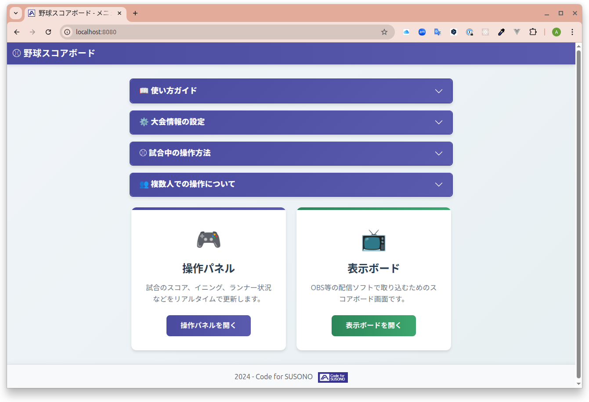

# 野球中継スコアボード (Baseball Broadcast Board)

YouTube 等のライブ配信で野球の試合を中継する際に、OBS のような配信ソフトウェアにスコアボード画面をクロマキー合成で表示するためのアプリケーションです。


## 主な機能

- **リアルタイム更新**: 操作パネルから入力した内容が、WebSocket を通じて即座に表示ボードへ反映されます。
- **シンプルな操作画面**: Web ブラウザから誰でも簡単に試合状況（スコア、イニング、SBO カウント、ランナー情報）を更新できます。
- **OBS 連携**: 表示ボードは背景が緑色になっており、OBS などの配信ソフトウェアで簡単にクロマキー合成できます。

## システム構成

トップページ(`index.html`)から、操作パネル(`operation.html`)と表示ボード(`board.html`)へアクセスします。操作パネルと表示ボードは、WebSocket サーバー(`server.js`)を介してリアルタイムに通信します。

```
+-------------------+
| トップページ      |
| (index.html)      |
+-------------------+
     |
     |
     v
+-------------------+      (WebSocket)      +------------------+
| 操作パネル        |---------------------->| WebSocketサーバー |
| (operation.html)  |<----------------------| (server.js)      |
+-------------------+                       +------------------+
                                                     | (WebSocket)
                                                     |
                                                     v
                                              +------------------+
                                              | 表示ボード       |
                                              | (board.html)     |
                                              +------------------+
```

## 主要ファイル構成

```
.
├── index.html          # トップページ（メニュー）
├── operation.html      # 操作パネルのUI
├── board.html          # OBS等で表示するスコアボード画面
├── init_data.json      # 大会名・チーム名の初期設定ファイル
├── server.js           # WebサーバーとWebSocketサーバー
├── package.json        # プロジェクト情報と依存ライブラリ
├── js/
│   ├── Scoreboard.js   # Vue.jsのスコアボードコンポーネント
│   └── main.js         # 操作パネルのVue.jsアプリケーション
├── css/                # スタイルシート
└── doc/                # ドキュメントや画像
```

## 技術スタック

- **フロントエンド**:
  - HTML5 / CSS3
  - Bootstrap 5
  - Vue.js 3
- **バックエンド**:
  - Node.js
  - ws (WebSocket ライブラリ)

## セットアップと実行方法

**前提条件**: [Node.js](https://nodejs.org/)と npm がインストールされていること。

1.  **依存関係のインストール**:
    プロジェクトのルートディレクトリで以下のコマンドを実行します。

    ```bash
    npm install
    ```

2.  **サーバーの起動**:
    以下のコマンドでサーバーを起動します。

    ```bash
    node server.js
    ```

    コンソールに`Server is listening on port 8080`と表示されれば成功です。

3.  **アプリケーションの使用**:

    - **トップページ**: `http://localhost:8080/` または `http://localhost:8080/index.html` にアクセスします。
      
    - **操作パネル**: `http://localhost:8080/operation.html` にアクセスします。
      
    - **表示ボード**: `http://localhost:8080/board.html` にアクセスします。この URL を OBS 等のブラウザソースに設定してください。

4.  **サーバーの停止**:
    サーバーを起動したターミナルで `Ctrl + C` を押すと停止します。

## 初期値の設定

操作パネルを開いた際の「大会名」と「チーム名」は `init_data.json` ファイルに記述されています。このファイルを編集することで、初期値を変更できます。

`init_data.json`

```json
{
  "game_title": "大会名",
  "team_top": "チーム名1",
  "team_bottom": "チーム名2"
}
```

## 利用しているオープンソースソフトウェア

- [Vue.js (v3.1.5)](https://github.com/vuejs/core/releases/tag/v3.1.5) - [MIT License](https://github.com/vuejs/core/blob/v3.1.5/LICENSE)
- [Bootstrap (v5.0.2)](https://github.com/twbs/bootstrap/releases/tag/v5.0.2) - [MIT License](https://github.com/twbs/bootstrap/blob/v5.0.2/LICENSE)
- [ws (v8.17.0)](https://github.com/websockets/ws) - [MIT License](https://github.com/websockets/ws/blob/master/LICENSE)
