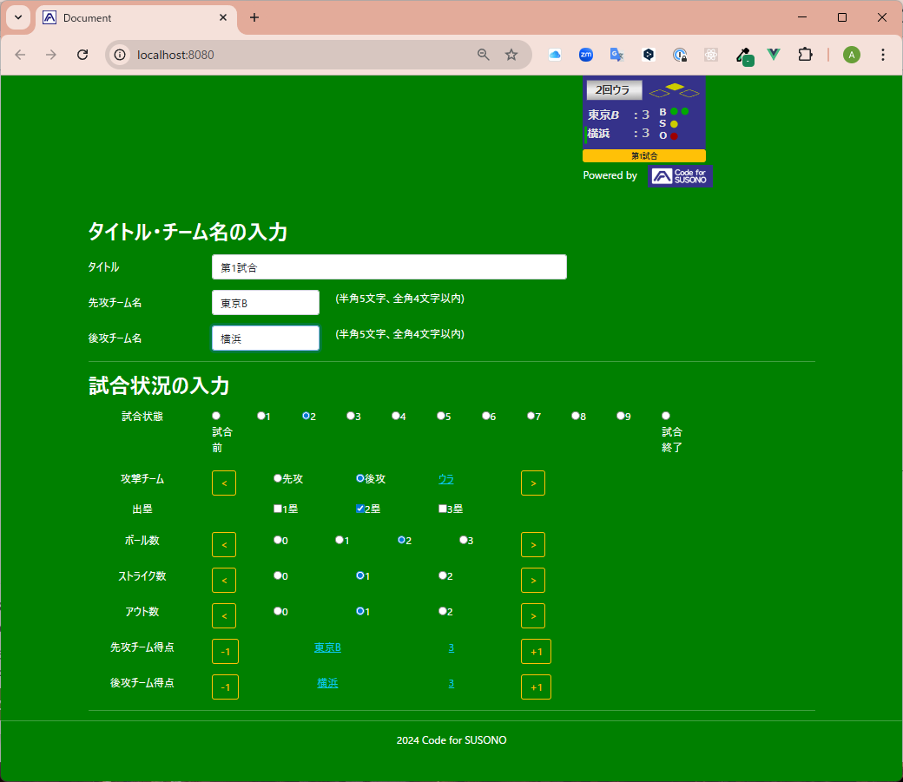
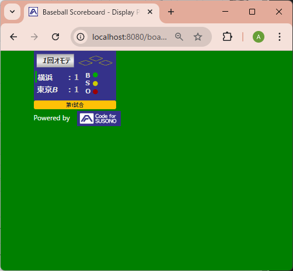

## Baseball Broadcast Board

### はじめに

YouTube 等で野球の試合を配信する際、チームの得点状況・ランナーの状況・ストライク/ボールの状況を集約し、OBS にクロマキー合成して表示することを想定し作成した。

### 構成

主に 2 つの部分で構成

1.  **操作パネル (`index.html`)**: オペレーターがスコア、イニング、カウント（ボール、ストライク、アウト）、ランナーの状況などの試合状況を入力・更新するための Web インターフェース
2.  **表示ボード (`board.html`)**: 試合状況を SVG 画像として描画する別の Web ページです。このページは、OBS などの配信ソフトウェアでブラウザソースとして使用することを想定しており、クロマキー合成が容易なように背景は緑色にしている

操作パネルで行われた変更は、WebSocket を使用してリアルタイムで表示ボードに即座に反映される。

### 技術スタック

- **フロントエンド**:

  - HTML5
  - CSS3 (スタイリングには Bootstrap を使用)
  - JavaScript
  - **Vue.js (v3)**: リアクティブな UI の作成、コンポーネントの状態管理、およびスコアボード表示を再利用可能なコンポーネントに分離するために使用

- **バックエンド**:
  - **Node.js**: サーバーの実行環境
  - **`ws` ライブラリ**: 操作パネルと表示ボード間のリアルタイム通信を処理する WebSocket サーバーを実装するために使用
  - **Node.js `http` モジュール**: ファイル（`.html`、`.css`、`.js`）が配信できるように`server.js`に組み込み

### 使用手順

**前提条件**: システムに[Node.js](https://nodejs.org/)と npm がインストールされていること

1.  **依存関係のインストール**: プロジェクトのルートディレクトリでターミナルを開き、次のコマンドを実行して必要な WebSocket ライブラリをインストールします。

    ```bash
    npm install
    ```

2.  **サーバーの起動**: 次のコマンドを実行して、Web サーバーと WebSocket サーバーを起動します。

    ```bash
    node server.js
    ```

    コンソールに、HTTP および WebSocket サーバーがポート 8080 で実行されていることを示すメッセージが表示されます。

3.  **アプリケーションの使用**:
    - **操作パネル**: Web ブラウザを開き、`http://localhost:8080/index.html`にアクセスし、試合状況を入力する
      　　
    - **表示ボード**: 別のブラウザタブまたはウィンドウを開き、`http://localhost:8080/board.html`にアクセスします。この URL を配信ソフトウェアのブラウザソースとして使用できます。
      　　

### 利用している OSS

- [Vue.js v3.1.5](https://github.com/vuejs/core/releases/tag/v3.1.5) - [MIT License](https://github.com/vuejs/core/blob/v3.1.5/LICENSE)
- [Bootstrap v5.0.2](https://github.com/twbs/bootstrap/releases/tag/v5.0.2) - [MIT License](https://github.com/twbs/bootstrap/blob/v5.0.2/LICENSE)
