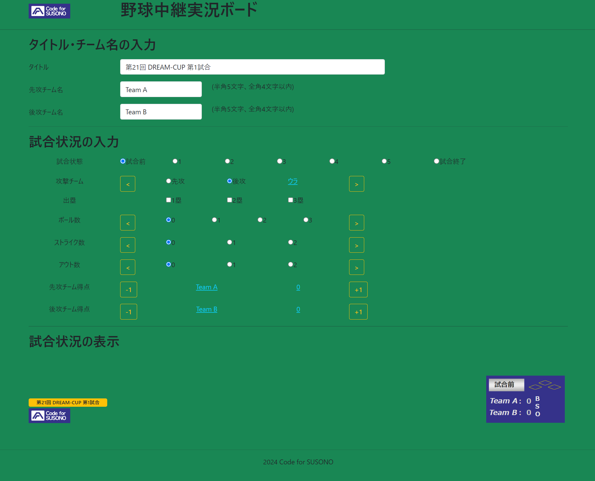

## Basebase Broadcase Board

### はじめに

YouTube等で野球の試合を配信する際、チームの得点状況・ランナーの状況・ストライク/ボールの状況を集約し、OBSにクロマキー合成して表示することを想定し作成した。

### 使い方

#### Webサーバ不要

Vue.jsを使っているので、特にWebサーバを立ち上げなくても、index.htmlファイルをブラウザで表示すれば利用可能。

#### ブラウザで操作すればOK

ブラウザ上で各種情報を入力し、チェックボックス等でアイテムを操作すると、その情報が集約されSVGイメージとして表示される。

### 利用しているOSS

* [Vue.js v3.1.5](https://github.com/vuejs/core/releases/tag/v3.1.5) - [MIT License](https://github.com/vuejs/core/blob/v3.1.5/LICENSE)
* [Bootstrap v5.0.2](https://github.com/twbs/bootstrap/releases/tag/v5.0.2) - [MIT License](https://github.com/twbs/bootstrap/blob/v5.0.2/LICENSE)