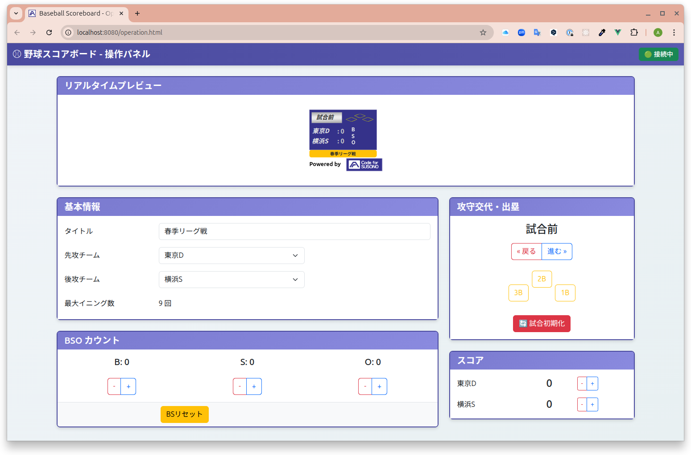

# 野球中継スコアボード (Baseball Broadcast Board)

YouTube 等のライブ配信で野球の試合を中継する際に、OBS のような配信ソフトウェアにスコアボード画面をクロマキー合成で表示するためのアプリケーションです。


## 主な機能

- **リアルタイム更新**: 操作パネルから入力した内容が、WebSocket を通じて即座に表示ボードへ反映されます。
- **シンプルな操作画面**: Web ブラウザから誰でも簡単に試合状況（スコア、イニング、SBO カウント、ランナー情報）を更新できます。
- **OBS 連携**: 表示ボードは背景が緑色になっており、OBS などの配信ソフトウェアで簡単にクロマキー合成できます。
- **マルチPC対応**: サーバーのIPアドレスを指定することで、別のPCから操作パネルと表示ボードにアクセス可能です。
- **設定自動生成**: コマンドラインツールで`init_data.json`を簡単に生成できます（インタラクティブモード、YAML、コマンドライン引数の3つの方法に対応）。

## システム構成

トップページ(`index.html`)から、操作パネル(`operation.html`)と表示ボード(`board.html`)へアクセスします。操作パネルと表示ボードは、WebSocket サーバー(`server.js`)を介してリアルタイムに通信します。


## 主要ファイル構成

```
.
├── index.html              # トップページ（メニュー）
├── operation.html          # 操作パネルのUI
├── board.html              # OBS等で表示するスコアボード画面
├── init_data.json          # 大会名・チーム名の初期設定ファイル
├── generate-init-data.js   # init_data.json生成ツール
├── config.yaml.example     # YAML設定ファイルのサンプル
├── server.js               # WebサーバーとWebSocketサーバー
├── package.json            # プロジェクト情報と依存ライブラリ
├── js/
│   ├── Scoreboard.js       # Vue.jsのスコアボードコンポーネント
│   ├── main.js             # 操作パネルのVue.jsアプリケーション
│   └── board.js            # 表示ボードのVue.jsアプリケーション
├── css/                    # スタイルシート
└── doc/                    # ドキュメントや画像
```

## 技術スタック

- **フロントエンド**:
  - HTML5 / CSS3
  - Bootstrap 5
  - Vue.js 3
- **バックエンド**:
  - Node.js
  - ws (WebSocket ライブラリ)
  - js-yaml (YAML パーサー)

## セットアップと実行方法

**前提条件**: [Node.js](https://nodejs.org/)と npm がインストールされていること。

1.  **依存関係のインストール**:
    プロジェクトのルートディレクトリで以下のコマンドを実行します。

    ```bash
    npm install
    ```

2.  **サーバーの起動**:
    サーバーは「開発モード」と「本番モード」の 2 つのモードで実行できます。

    - **開発モード（ログ出力あり）**
      ターミナルにデバッグ用のログが出力されます。

      ```bash
      node server.js
      ```

      コンソールに`Server is listening on port 8080`などのメッセージが表示されれば成功です。

    - **本番モード（ログ出力なし）**
      本番の配信などでログを非表示にする場合は、`NODE_ENV`環境変数を`production`に設定して起動します。
      ```bash
      NODE_ENV=production node server.js
      ```

3.  **アプリケーションの使用**:

    - **トップページ**: `http://localhost:8080/` または `http://localhost:8080/index.html` にアクセスします。
      
    - **操作パネル**: `http://localhost:8080/operation.html` にアクセスします。
      
    - **表示ボード**: `http://localhost:8080/board.html` にアクセスします。この URL を OBS 等のブラウザソースに設定してください。

4.  **サーバーの停止**:
    サーバーを起動したターミナルで `Ctrl + C` を押すと停止します。

## マルチPC構成での使用方法

別のPCから操作パネルや表示ボードにアクセスする場合:

1. **サーバーのIPアドレスを確認**:

   サーバーを起動しているPCで以下のコマンドを実行します:

   ```bash
   # Linux/Mac
   hostname -I

   # Windows
   ipconfig
   ```

2. **別のPCからアクセス**:

   `localhost` をサーバーのIPアドレスに置き換えてアクセスします:

   ```
   http://192.168.1.100:8080/             # トップページ
   http://192.168.1.100:8080/operation.html  # 操作パネル
   http://192.168.1.100:8080/board.html      # 表示ボード
   ```

3. **OBSでの設定**:

   - OBSで「ソース」→「追加」→「ブラウザ」を選択
   - URLに表示ボードのアドレスを入力: `http://192.168.1.100:8080/board.html`
   - 幅: 1920、高さ: 1080 を推奨
   - カスタムCSSで背景を透過: `body { background-color: rgba(0, 0, 0, 0); }`
   - クロマキー合成が必要な場合はフィルタで緑色を抜く

WebSocket接続は、アクセスしたURLのホスト名を自動的に使用するため、追加の設定は不要です。

## 初期設定ファイルの生成

操作パネルを開いた際の初期値は `init_data.json` ファイルで設定します。このファイルは **自動生成ツール** を使って簡単に作成できます。

### 自動生成ツールの使い方

3つの方法で `init_data.json` を生成できます:

#### 1. インタラクティブモード（推奨）

対話形式で入力します:

```bash
npm run init
```

実行例:
```
大会名を入力してください [現在: 大会名]: 春季リーグ戦
試合の最終イニングを入力してください [現在: 9]: 9
参加チーム名を入力してください [入力終了: enterのみ]:
  チーム 1: 東京ドラゴンズ
  チーム 2: 横浜スターズ
  チーム 3: 大阪タイガース
  チーム 4:

✓ 先攻チーム: 東京ドラゴンズ
✓ 後攻チーム: 横浜スターズ
✓ init_data.json を生成しました
```

#### 2. YAMLファイルから生成

YAMLファイルを用意して生成します:

```bash
# サンプルファイルをコピー
cp config.yaml.example my-config.yaml

# 編集
nano my-config.yaml

# 生成
npm run init my-config.yaml
```

YAMLファイルの例（`my-config.yaml`）:
```yaml
game_title: 春季リーグ戦
last_inning: 9
team_names:
  - 東京ドラゴンズ
  - 横浜スターズ
  - 大阪タイガース
  - 名古屋ホエールズ
```

#### 3. コマンドライン引数で生成

一行のコマンドで直接指定します:

```bash
npm run init -- -t "春季リーグ戦" -i 9 --teams "東京ドラゴンズ,横浜スターズ,大阪タイガース"
```

オプション:
- `-t, --title <string>`: 大会名（必須）
- `-i, --innings <number>`: 最終イニング（1-9、デフォルト: 9）
- `--teams <string>`: 参加チーム（カンマ区切り、必須、最低2チーム）
- `-h, --help`: ヘルプ表示

### 自動生成ルール

- **先攻チーム** (`team_top`): 参加チームの1番目
- **後攻チーム** (`team_bottom`): 参加チームの2番目
- **イニング配列** (`game_array`): `["試合前", 1, 2, ..., イニング数, "試合終了"]`
- **チーム選択肢** (`team_items`): `["　", チーム1, チーム2, ...]` ※先頭は全角スペース

### バリデーション

- 参加チーム数: 最低2チーム必要
- 最終イニング: 1から9の範囲

### バックアップ機能

既存の `init_data.json` がある場合、自動的に `init_data.json.bak` にバックアップされます。

### 生成される init_data.json の例

```json
{
  "game_title": "春季リーグ戦",
  "team_top": "東京ドラゴンズ",
  "team_bottom": "横浜スターズ",
  "game_array": ["試合前", 1, 2, 3, 4, 5, 6, 7, 8, 9, "試合終了"],
  "team_items": ["　", "東京ドラゴンズ", "横浜スターズ", "大阪タイガース"],
  "last_inning": 9
}
```

### 手動編集

もちろん、`init_data.json` を直接編集することも可能です。

- `game_title`: 大会名
- `team_top`: 先攻チーム
- `team_bottom`: 後攻チーム
- `game_array`: イニング選択プルダウンの選択肢
- `team_items`: チーム名選択プルダウンの選択肢（先頭は全角スペース）
- `last_inning`: 最終イニング

## 利用しているオープンソースソフトウェア

- [Vue.js (v3.1.5)](https://github.com/vuejs/core/releases/tag/v3.1.5) - [MIT License](https://github.com/vuejs/core/blob/v3.1.5/LICENSE)
- [Bootstrap (v5.0.2)](https://github.com/twbs/bootstrap/releases/tag/v5.0.2) - [MIT License](https://github.com/twbs/bootstrap/blob/v5.0.2/LICENSE)
- [ws (v8.13.0)](https://github.com/websockets/ws) - [MIT License](https://github.com/websockets/ws/blob/master/LICENSE)
- [js-yaml (v4.1.0)](https://github.com/nodeca/js-yaml) - [MIT License](https://github.com/nodeca/js-yaml/blob/master/LICENSE)

## 開発者向け情報

### アーキテクチャの詳細

詳細な実装ガイドやアーキテクチャについては、[CLAUDE.md](CLAUDE.md) を参照してください。

### 主な変更履歴

- **マルチPC対応**: WebSocket URLを動的に生成することで、localhost以外からのアクセスに対応
- **設定自動生成ツール**: `generate-init-data.js` により、`init_data.json` を簡単に生成可能
- **洗練されたUI**: index.htmlのデザインを刷新し、使い方ガイドを追加
