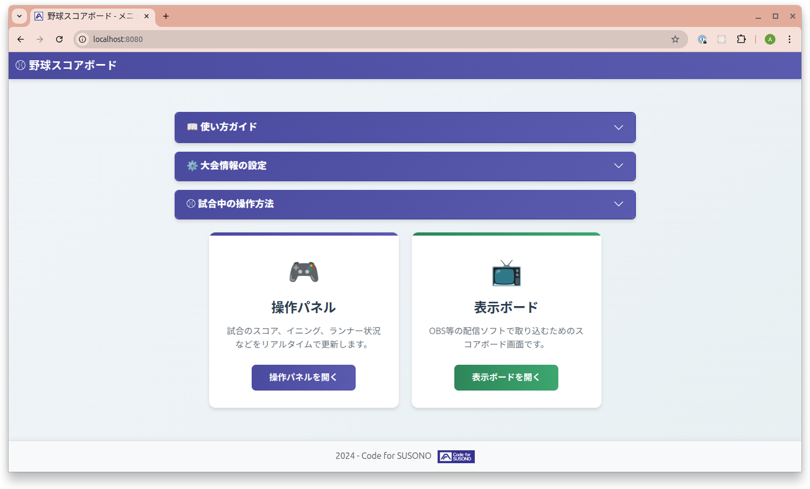

# 野球中継スコアボード (Baseball Broadcast Board)

YouTube等のライブ配信で野球の試合を中継する際に、OBSにスコアボードをクロマキー合成で表示するためのアプリケーションです。


## ✨ 主な機能

- **簡単操作**: ブラウザまたは専用アプリで試合状況を更新
- **リアルタイム反映**: 操作パネルの変更が即座にスコアボードへ反映
- **OBS対応**: 背景色をカスタマイズしてクロマキー合成
- **状態保存**: 試合途中で中断しても再開可能
- **複数PC対応**: 操作PCと配信PCを分けて運用可能

## 📥 インストール方法

### Electron版（推奨 - スタンドアロンアプリ）

#### Linux（動作確認済み）

```bash
# ビルド
npm install
npm run build:linux

# 実行
sudo apt install libfuse2  # Ubuntu 24.04以降のみ
./dist/Baseball\ Scoreboard-1.0.0.AppImage --no-sandbox
```


初回起動時に設定ウィンドウが開き、試合設定を行えます。


#### Windows / macOS

```bash
npm run build:win    # Windows
npm run build:mac    # macOS
```

### Web版（複数PC環境向け）

```bash
# サーバー起動
npm install
node server.js

# ブラウザでアクセス
http://localhost:8080/operation.html  # 操作パネル
http://localhost:8080/board.html      # 表示ボード
```

複数PCからアクセスする場合は`localhost`をサーバーのIPアドレスに変更してください。




詳細: [マルチPC環境構築ガイド](doc/MULTI_PC_SETUP.md)

## 🚀 基本的な使い方

### 1. 試合設定

**Electron版**:
1. 設定ウィンドウ（`Ctrl/Cmd+,`）を開く
2. YAMLファイルを選択または新規作成
3. 「✅ 設定ファイルを生成」をクリック

**Web版**:
```bash
npm run init
```

対話形式で大会名、チーム名、イニング数を入力します。

詳細: [設定ファイルガイド](doc/CONFIGURATION.md)

### 2. 試合開始

1. 操作パネルを開く
2. イニングと表裏を選択
3. スコアやランナーをボタンで更新

### 3. OBSに表示

1. OBS → ソース → ブラウザ
2. URL: `http://localhost:8080/board.html`
3. 幅: 1920、高さ: 1080
4. エフェクトフィルタ → クロマキー → 背景色を抜く

詳細: [ユーザーガイド](doc/USER_GUIDE.md)

## ❓ よくある質問

<details>
<summary>複数人で同時に操作できますか？</summary>

最初に接続した人のみが操作可能（マスター）となります。後から接続した人は閲覧専用（スレーブ）です。マスター権限は手動で解放できます。

詳細: [Master/Slave制御](doc/MASTER_SLAVE_ARCHITECTURE.md)
</details>

<details>
<summary>試合をリセットするには？</summary>

操作パネルの「🔄 試合初期化」ボタンでリセットできます（チーム名は保持）。新しい大会を始める場合は「📋 新規大会で初期化」を使用してください。
</details>

<details>
<summary>接続が切れた場合は？</summary>

自動的に再接続を試みます（最大10回）。接続状態はナビゲーションバーで確認できます。

詳細: [WebSocket再接続](doc/WEBSOCKET_RECONNECTION.md)
</details>

<details>
<summary>マルチPC環境で使うには？</summary>

サーバーのIPアドレスを確認し、他のPCからそのIPアドレスでアクセスしてください。

詳細: [マルチPC環境構築ガイド](doc/MULTI_PC_SETUP.md)
</details>

<details>
<summary>背景色を変更するには？</summary>

**Electron版**: 設定ウィンドウ（`Ctrl/Cmd+,`）の「🎨 表示ボード設定」カードで変更

**Web版**: `npm run init`で設定時に指定、またはYAMLファイルで`board_background_color`を設定

推奨色: グリーン `#00ff00`、マゼンタ `#ff00ff`、ブルー `#0000ff`
</details>

## 📚 ドキュメント

### 一般ユーザー向け
- **[詳細な使い方](doc/USER_GUIDE.md)** - 各機能の詳細説明、OBS設定のTips
- **[設定ファイルガイド](doc/CONFIGURATION.md)** - YAMLファイルの作成・編集方法
- **[マルチPC環境構築](doc/MULTI_PC_SETUP.md)** - 複数PCでの運用方法
- **[トラブルシューティング](doc/TROUBLESHOOTING.md)** - よくある問題と解決方法

### Electron版ユーザー向け
- **[Electronデプロイガイド](doc/ELECTRON_DEPLOYMENT.md)** - ビルド方法と実行手順
- **[設定ウィンドウガイド](doc/ELECTRON_SETTINGS.md)** - 設定ウィンドウの使い方

### 運用管理者向け
- **[本番環境デプロイ](doc/PRODUCTION_DEPLOYMENT.md)** - PM2を使った運用方法

### 開発者向け
- **[システムアーキテクチャ](doc/ARCHITECTURE.md)** - 技術スタック、状態管理、WebSocketプロトコル
- **[Master/Slave制御](doc/MASTER_SLAVE_ARCHITECTURE.md)** - 詳細な実装と仕様
- **[WebSocket再接続](doc/WEBSOCKET_RECONNECTION.md)** - 再接続機能の実装詳細

## 📄 ライセンス

このプロジェクトのライセンスは[CC BY-NC 4.0](https://creativecommons.org/licenses/by-nc/4.0/deed.ja)です。商用利用についてはCode for SUSONOへお問い合わせ下さい。

### 利用しているオープンソースソフトウェア

このプロジェクトは以下のオープンソースソフトウェアを使用しています（すべてMITライセンス）:

- [Vue.js](https://github.com/vuejs/core) (v3.4.0+) - [MIT License](https://github.com/vuejs/core/blob/main/LICENSE)
- [Bootstrap](https://github.com/twbs/bootstrap) (v5.3.3+) - [MIT License](https://github.com/twbs/bootstrap/blob/main/LICENSE)
- [ws](https://github.com/websockets/ws) (v8.13.0+) - [MIT License](https://github.com/websockets/ws/blob/master/LICENSE)
- [js-yaml](https://github.com/nodeca/js-yaml) (v4.1.0+) - [MIT License](https://github.com/nodeca/js-yaml/blob/master/LICENSE)

実際にインストールされるバージョンは `package-lock.json` をご確認ください。
