# 野球中継スコアボード (Baseball Broadcast Board)

YouTube 等のライブ配信で野球の試合を中継する際に、OBS のような配信ソフトウェアにスコアボード画面をクロマキー合成で表示するためのアプリケーションです。


## 主な機能

- **リアルタイム更新**: 操作パネルから入力した内容が、WebSocket を通じて即座に表示ボードへ反映されます。
- **状態の永続化**: 試合状況がサーバー側に自動保存され、ブラウザのリフレッシュやサーバー再起動後も試合を継続できます。
- **シンプルな操作画面**: Web ブラウザから誰でも簡単に試合状況（スコア、イニング、SBO カウント、ランナー情報）を更新できます。
- **OBS 連携**: 表示ボードは背景が緑色になっており、OBS などの配信ソフトウェアで簡単にクロマキー合成できます。
- **マルチPC対応**: サーバーのIPアドレスを指定することで、別のPCから操作パネルと表示ボードにアクセス可能です。
- **設定自動生成**: コマンドラインツールで`init_data.json`を簡単に生成できます（インタラクティブモード、YAML、コマンドライン引数の3つの方法に対応）。

## システム構成

トップページ(`index.html`)から、操作パネル(`operation.html`)と表示ボード(`board.html`)へアクセスします。操作パネルと表示ボードは、WebSocket サーバー(`server.js`)を介してリアルタイムに通信します。

```mermaid
graph LR;
    subgraph "サーバー"
        D("WebSocketサーバー</br>server.js</br><i>Master/Slave制御</i>");
    end

    subgraph "クライアント (ブラウザ)"
        A("トップページ</br>index.html");
        B1("操作パネル 1</br>operation.html</br><b>Master</b>");
        B2("操作パネル 2</br>operation.html</br><i>Slave (read-only)</i>");
        C("表示ボード</br>board.html</br><i>Viewer</i>");
    end

    D <-->|WebSocket</br>game_state_update| B1;
    D -->|WebSocket</br>game_state| B2;
    D -->|WebSocket</br>game_state| C;
    A --> B1;
    A --> B2;
    A --> C;
```



## 主要ファイル構成

```
.
├── public/                 # 静的ファイル（Webサーバーが配信）
│   ├── index.html          # トップページ（メニュー）
│   ├── operation.html      # 操作パネルのUI
│   ├── board.html          # OBS等で表示するスコアボード画面
│   ├── css/
│   │   ├── main.css        # カスタムスタイル
│   │   └── bootstrap.min.css   # Bootstrap CSS (npm経由で自動生成)
│   ├── js/
│   │   ├── Scoreboard.js   # Vue.jsのスコアボードコンポーネント
│   │   ├── main.js         # 操作パネルのVue.jsアプリケーション
│   │   ├── board.js        # 表示ボードのVue.jsアプリケーション
│   │   ├── vue.global.js   # Vue.js (npm経由で自動生成)
│   │   └── bootstrap.bundle.min.js  # Bootstrap JS (npm経由で自動生成)
│   └── img/                # 画像ファイル
├── scripts/                # ビルド・ユーティリティスクリプト
│   ├── copy-deps.js        # npm依存関係をpublic/にコピーするスクリプト
│   └── generate-init-data.js  # init_data.json生成ツール
├── config/                 # 設定ファイル
│   ├── init_data.json      # 大会名・チーム名の初期設定ファイル
│   └── config.yaml.example # YAML設定ファイルのサンプル
├── data/                   # 実行時データ
│   └── current_game.json   # 試合状況の保存ファイル（自動生成）
├── logs/                   # ログファイル
│   ├── pm2-error.log       # PM2エラーログ（自動生成）
│   └── pm2-out.log         # PM2標準出力ログ（自動生成）
├── ecosystem.config.js     # PM2設定ファイル
├── server.js               # WebサーバーとWebSocketサーバー
├── package.json            # プロジェクト情報と依存ライブラリ
└── doc/                    # ドキュメントや画像
```

## 技術スタック

- **フロントエンド**:
  - HTML5 / CSS3
  - Bootstrap 5
  - Vue.js 3
- **バックエンド**:
  - Node.js
  - ws (WebSocket ライブラリ)
  - js-yaml (YAML パーサー)

## セットアップと実行方法

**前提条件**: [Node.js](https://nodejs.org/)と npm がインストールされていること。

1.  **依存関係のインストール**:
    プロジェクトのルートディレクトリで以下のコマンドを実行します。

    ```bash
    npm install
    ```

    このコマンドにより、以下が自動的に実行されます:
    - 必要なnpmパッケージ（Bootstrap、Vue.js、ws、js-yamlなど）のインストール
    - `postinstall`フックによる依存ファイルの自動コピー（Bootstrap CSS/JS、Vue.jsを`css/`と`js/`ディレクトリへ）

2.  **サーバーの起動**:
    サーバーは「開発モード」と「本番モード」の 2 つのモードで実行できます。

    - **開発モード（ログ出力あり）**
      ターミナルにデバッグ用のログが出力されます。

      ```bash
      node server.js
      ```

      コンソールに`Server is listening on port 8080`などのメッセージが表示されれば成功です。

    - **本番モード（ログ出力なし）**
      本番の配信などでログを非表示にする場合は、`NODE_ENV`環境変数を`production`に設定して起動します。
      ```bash
      NODE_ENV=production node server.js
      ```

3.  **アプリケーションの使用**:

    - **トップページ**: `http://localhost:8080/` または `http://localhost:8080/index.html` にアクセスします。
      
    - **操作パネル**: `http://localhost:8080/operation.html` にアクセスします。
      
       
    - **表示ボード**: `http://localhost:8080/board.html` にアクセスします。この URL を OBS 等のブラウザソースに設定してください。

4.  **サーバーの停止**:
    サーバーを起動したターミナルで `Ctrl + C` を押すと停止します。

## マルチPC構成での使用方法

別のPCから操作パネルや表示ボードにアクセスする場合:

1. **サーバーのIPアドレスを確認**:

   サーバーを起動しているPCで以下のコマンドを実行します:

   ```bash
   # Linux/Mac
   hostname -I

   # Windows
   ipconfig
   ```

2. **別のPCからアクセス**:

   `localhost` をサーバーのIPアドレスに置き換えてアクセスします:

   ```
   http://192.168.1.100:8080/             # トップページ
   http://192.168.1.100:8080/operation.html  # 操作パネル
   http://192.168.1.100:8080/board.html      # 表示ボード
   ```

3. **OBSでの設定**:

   - OBSで「ソース」→「追加」→「ブラウザ」を選択
   - URLに表示ボードのアドレスを入力: `http://192.168.1.100:8080/board.html`
   - クロマキー合成で緑色を抜く

WebSocket接続は、アクセスしたURLのホスト名を自動的に使用するため、追加の設定は不要です。

**⚠️ 注意: 複数人での同時操作について**

複数の端末から`operation.html`に同時にアクセスした場合、最初に接続した端末のみが操作可能（Master）となり、後から接続した端末は閲覧専用（Slave）となります。詳細は[Master/Slave Operation Control](#masterslave-operation-control)セクションをご覧ください。

## Master/Slave Operation Control

### Overview

The system implements a master/slave architecture to prevent conflicting updates when multiple users access the operation panel simultaneously:

- **Master**: The first client to connect to `operation.html` becomes the master and has full control
- **Slave**: Subsequent connections become slaves with read-only access
- **Automatic Promotion**: When the master disconnects, the oldest slave is automatically promoted to master
- **Manual Release**: Masters can voluntarily release control to allow another user to take over

### Architecture

#### Server-Side Role Management (server.js)

The server maintains a map of all connected clients with their metadata:

```javascript
const clients = new Map(); // Map<clientId, {ws, type, role, connectedAt}>
let masterClientId = null;
```

**Key Components:**

1. **Client Identification** (lines 62-68):
   - Each WebSocket connection receives a unique ID: `client_${counter}_${timestamp}`
   - Client type is determined via handshake message

2. **Role Assignment** (lines 147-190):
   - Operation clients: first connection → master, others → slave
   - Board clients: always assigned viewer role
   - Handshake timeout (3 seconds): clients without handshake treated as board

3. **Message Filtering** (lines 210-229):
   - Only master can send `game_state_update` messages
   - Updates from non-master clients are logged and rejected
   - All clients receive broadcasted game state updates

4. **Promotion Algorithm** (lines 93-114):
   - On master disconnect, find all operation slaves
   - Sort by connection time (oldest first)
   - Promote the oldest slave to master
   - Send `role_changed` notification

#### Client-Side Role Management (public/js/main.js)

**State Variables** (lines 30-32):
```javascript
clientRole: null,  // null | 'master' | 'slave'
clientId: null,
masterClientId: null,
```

**Key Features:**

1. **Handshake** (lines 115-119):
   - Sends `{type: 'handshake', client_type: 'operation'}` on connection
   - Identifies as operation client (vs board)

2. **Role Message Handling** (lines 127-152):
   - `role_assignment`: Initial role from server
   - `role_changed`: Role update (promotion or demotion)
   - `game_state`: State updates from other clients

3. **UI Control** (lines 89-96):
   - `isOperationDisabled` computed property returns true for slaves
   - All operation buttons use `:disabled="isOperationDisabled"`

4. **Update Gating** (lines 188-196):
   - `updateBoard()` only sends updates if `clientRole === 'master'`
   - Prevents slaves from accidentally sending state changes

5. **Manual Release** (lines 337-349):
   - `releaseMasterControl()` method sends `release_master` message
   - Only available to masters
   - Triggers confirmation dialog

#### UI Indicators (public/operation.html)

**Status Display** (lines 180-202):
- Green badge: 👑 Master (操作可能)
- Yellow badge: 👁️ Slave (閲覧専用)
- Displayed in navigation bar for visibility

**Slave Warning Banner** (lines 208-217):
- Alert box at top of page when role is slave
- Explains read-only status
- Informs user about automatic promotion

**Master Control Card** (lines 366-380):
- Only visible when `clientRole === 'master'`
- Contains release button
- Positioned in right column for easy access

### Message Protocol

#### Client → Server Messages

**Handshake**:
```json
{
  "type": "handshake",
  "client_type": "operation" | "board"
}
```

**Game State Update** (master only):
```json
{
  "type": "game_state_update",
  "data": {
    "game_title": "...",
    "team_top": "...",
    "game_inning": 1,
    ...
  }
}
```

**Release Master**:
```json
{
  "type": "release_master"
}
```

#### Server → Client Messages

**Role Assignment**:
```json
{
  "type": "role_assignment",
  "role": "master" | "slave" | "viewer",
  "clientId": "client_1_1234567890",
  "masterClientId": "client_0_1234567889"
}
```

**Role Change**:
```json
{
  "type": "role_changed",
  "newRole": "master" | "slave",
  "reason": "master_disconnected" | "master_released"
}
```

**Game State Broadcast**:
```json
{
  "type": "game_state",
  "data": { ... }
}
```

### Operation Flows

#### Initial Connection

```
1. Client connects to WebSocket
2. Client sends handshake {type: "handshake", client_type: "operation"}
3. Server checks if master exists
   - No master → assign role: "master", set masterClientId
   - Master exists → assign role: "slave"
4. Server sends role_assignment message
5. Server sends current game_state
6. Client displays role indicator and enables/disables UI
```

#### Master Disconnect

```
1. Master's WebSocket closes
2. Server detects close event
3. Server calls promoteNextMaster()
4. Server finds oldest slave by connectedAt timestamp
5. Server updates slave's role to "master"
6. Server sends role_changed message to new master
7. New master enables UI controls
```

#### Manual Release

```
1. Master clicks "マスター権限を解放" button
2. Confirmation dialog appears
3. On confirm, client sends {type: "release_master"}
4. Server sets masterClientId = null
5. Server changes former master's role to "slave"
6. Server calls promoteNextMaster()
7. Server sends role_changed to both:
   - Former master (newRole: "slave")
   - New master (newRole: "master")
8. UI updates accordingly
```

### Edge Cases

**Simultaneous Connections**:
- Race conditions resolved by server-side sequential processing
- First processed handshake wins master role

**Network Interruption**:
- Auto-reconnect triggers new WebSocket connection
- Client treated as new connection (loses master if had it)
- Reconnection does not restore previous role

**Multiple Browser Tabs**:
- Each tab is an independent connection
- Only first tab becomes master
- Other tabs from same device become slaves

**Handshake Timeout**:
- Clients not sending handshake within 3 seconds treated as board
- Ensures backward compatibility with old board.html versions
- Board clients assigned "viewer" role (no operation rights)

### Backward Compatibility

**Board Clients**:
- `board.html` updated to send handshake (lines 72-76 in board.js)
- Old versions without handshake still work (timeout → viewer)
- Board clients never interfere with operation master/slave logic

**Legacy Game State Messages**:
- Messages without `type` field treated as game state updates
- Maintains compatibility with older client code
- Server checks: `if (data.type === 'game_state_update' || !data.type)`

### Testing

**Basic Functionality**:
```bash
# Terminal 1: Start server
node server.js

# Browser 1: Open operation panel
# Should see: 👑 Master (操作可能)
open http://localhost:8080/operation.html

# Browser 2: Open another operation panel
# Should see: 👁️ Slave (閲覧専用)
open http://localhost:8080/operation.html
```

**Master Promotion**:
1. Close Browser 1 (master)
2. Browser 2 should automatically become master
3. Check navigation bar for role change

**Manual Release**:
1. With Browser 1 as master and Browser 2 as slave
2. Click "マスター権限を解放" in Browser 1
3. Confirm dialog
4. Browser 1 becomes slave, Browser 2 becomes master

**Network Logging**:
```bash
# Enable detailed logging
node server.js

# Watch for log messages:
# - Client connected: client_X_timestamp
# - Client client_X_timestamp registered as operation/master
# - Client client_Y_timestamp registered as operation/slave
# - Rejected update from non-master client client_Y_timestamp
# - Master client_X_timestamp released control
# - Client client_Y_timestamp promoted to master
```

### Security Considerations

**Current Implementation**:
- No authentication: any client can connect
- Master determined solely by connection order
- Suitable for trusted local networks or single-user scenarios

**Potential Enhancements**:
- Password-protected master access
- IP-based access control
- Session-based role persistence
- Admin override capabilities

## 初期設定ファイルの生成

操作パネルを開いた際の初期値は `config/init_data.json` ファイルで設定します。このファイルは **自動生成ツール** を使って簡単に作成できます。

### 自動生成ツールの使い方

3つの方法で `init_data.json` を生成できます:

#### 1. インタラクティブモード（推奨）

対話形式で入力します:

```bash
npm run init
```

実行例:
```
大会名を入力してください [現在: 大会名]: 夏季大会
試合の最終イニングを入力してください [現在: 9]: 7
参加チーム名を入力してください [入力終了: enterのみ]:
  チーム 1: A
  チーム 2: B
  チーム 3: C
  チーム 4: D
  チーム 5: E

✓ 先攻チーム: A
✓ 後攻チーム: B
✓ init_data.json を生成しました
```

#### 2. YAMLファイルから生成

YAMLファイルを用意して生成します:

```bash
# サンプルファイルをコピー
cp config/config.yaml.example config/my-config.yaml

# 編集
nano config/my-config.yaml

# 生成
npm run init config/my-config.yaml
```

YAMLファイルの例（`config/my-config.yaml`）:
```yaml
game_title: 夏季大会
last_inning: 7
team_names:
  - A
  - B
  - C
  - D
  - E
```

#### 3. コマンドライン引数で生成

一行のコマンドで直接指定します:

```bash
npm run init -- -t "夏季大会" -i 7 --teams "A,B,C,D,E"
```

オプション:
- `-t, --title <string>`: 大会名（必須）
- `-i, --innings <number>`: 最終イニング（1-9、デフォルト: 9）
- `--teams <string>`: 参加チーム（カンマ区切り、必須、最低2チーム）
- `-h, --help`: ヘルプ表示

### 自動生成ルール

- **先攻チーム** (`team_top`): 参加チームの1番目
- **後攻チーム** (`team_bottom`): 参加チームの2番目
- **イニング配列** (`game_array`): `["試合前", 1, 2, ..., イニング数, "試合終了"]`
- **チーム選択肢** (`team_items`): `["　", チーム1, チーム2, ...]` ※先頭は全角スペース

### バリデーション

- 参加チーム数: 最低2チーム必要
- 最終イニング: 1から9の範囲

### バックアップ機能

既存の `config/init_data.json` がある場合、自動的に `config/init_data.json.bak` にバックアップされます。

### 生成される init_data.json の例

```json
{
  "game_title": "夏季大会",
  "team_top": "A",
  "team_bottom": "B",
  "game_array": ["試合前", 1, 2, 3, 4, 5, 6, 7, "試合終了"],
  "team_items": ["　", "A", "B", "C", "D","E"],
  "last_inning": 7
}
```

### 手動編集

もちろん、`config/init_data.json` を直接編集することも可能です。

- `game_title`: 大会名
- `team_top`: 先攻チーム
- `team_bottom`: 後攻チーム
- `game_array`: イニング選択プルダウンの選択肢
- `team_items`: チーム名選択プルダウンの選択肢（先頭は全角スペース）
- `last_inning`: 最終イニング

## 依存関係の管理

このプロジェクトでは、Bootstrap と Vue.js を npm 経由で管理しています。

### 依存ファイルの自動コピー

`npm install` を実行すると、`postinstall` フックにより `scripts/copy-deps.js` スクリプトが自動実行され、以下のファイルが `node_modules/` から静的ファイルディレクトリにコピーされます:

- `node_modules/bootstrap/dist/css/bootstrap.min.css` → `public/css/bootstrap.min.css`
- `node_modules/bootstrap/dist/js/bootstrap.bundle.min.js` → `public/js/bootstrap.bundle.min.js`
- `node_modules/vue/dist/vue.global.js` → `public/js/vue.global.js`

### 手動での依存ファイル更新

依存ファイルを手動で再コピーする場合は、以下のコマンドを実行します:

```bash
npm run build:deps
```

### 依存パッケージの更新

Bootstrap や Vue.js のバージョンを更新する場合:

1. `package.json` の依存バージョンを更新
2. `npm install` を実行（自動的に `copy-deps.js` が実行されます）

または、特定のパッケージを直接更新:

```bash
npm update bootstrap vue
```

## 状態の永続化

試合状況（スコア、イニング、BSO、ランナー等）はサーバー側で自動的に保存されます。

### 保存される情報

- 試合状況: `data/current_game.json` に自動保存
- 保存内容: スコア、イニング、表裏、BSO カウント、ランナー情報など

### 動作の詳細

1. **操作パネルでの変更**
   - スコアや BSO を変更すると、WebSocket 経由でサーバーに送信
   - サーバーが `data/current_game.json` に自動保存

2. **ブラウザをリフレッシュした場合**
   - 操作パネル、表示ボードともに最新の試合状況が復元される
   - 試合を中断せずに続行可能

3. **サーバーを再起動した場合**
   - サーバー起動時に `data/current_game.json` から状態を読み込み
   - 試合を中断した時点から再開可能

4. **試合途中で表示ボードを開いた場合**
   - サーバーが保持している最新の試合状況が即座に表示される
   - 操作パネルで何か操作する必要なし

### 大会設定と試合状況の違い

| ファイル | 用途 | 内容 |
|---------|------|------|
| `config/init_data.json` | 大会設定 | 大会名、参加チーム一覧、イニング数など |
| `data/current_game.json` | 試合状況 | スコア、BSO、ランナー、現在のイニングなど |

大会設定は手動または自動生成ツールで作成し、試合状況は実行時に自動的に保存・更新されます。

### データのリセット

新しい試合を開始する場合、以下の2つの方法があります。

#### 方法1: 操作パネルから初期化（推奨）

操作パネルの「攻守交代・出塁」カード内にある **「🔄 試合初期化」** ボタンを押すことで、試合状況をリセットできます。

**リセットされる内容:**
- イニング → 試合前（0回）
- 得点 → 両チーム0点
- BSO カウント → すべて0
- 出塁者 → すべてクリア

**注意事項:**
- 試合中でもボタンは有効ですが、確認ダイアログで警告が表示されます
- 初期化を実行すると、現在の試合状況はすべて失われます
- チーム名や大会名は変更されません（そのまま引き継がれます）

#### 方法2: コマンドラインから削除

サーバーにアクセスできる場合は、以下のコマンドでファイルを削除することもできます。

```bash
# 保存された試合状況を削除
rm data/current_game.json

# サーバーを再起動
node server.js
```

操作パネルを開くと `config/init_data.json` の初期値から開始されます。

## PM2を使った本番運用

本番環境では、PM2（Process Manager 2）を使用してサーバーを管理することを推奨します。PM2により、自動再起動、ログ管理、モニタリングなどの機能が利用できます。

### PM2のインストール

**グローバルインストール（本番環境）:**
```bash
npm install -g pm2
```

プロジェクトには既に開発依存関係として含まれています（`npm install` で自動的にインストールされます）。

### 基本的な使い方

#### サーバーの起動

**本番モードで起動:**
```bash
npm run pm2:start
```

**開発モードで起動:**
```bash
npm run pm2:dev
```

#### サーバーの操作

```bash
# ステータス確認
npm run pm2:status

# ログをリアルタイム表示
npm run pm2:logs

# サーバーの停止
npm run pm2:stop

# サーバーの再起動（ダウンタイムあり）
npm run pm2:restart

# サーバーのリロード（ゼロダウンタイム）
npm run pm2:reload

# PM2からアプリを削除
npm run pm2:delete

# リアルタイムモニタリング
npm run pm2:monit
```

### OS起動時の自動起動設定

サーバー再起動後も自動的にアプリケーションを起動する設定：

```bash
# 1. PM2のスタートアップスクリプトを生成
pm2 startup

# 表示されたコマンドを実行（sudoが必要な場合があります）
# 例: sudo env PATH=$PATH:/usr/bin pm2 startup systemd -u youruser --hp /home/youruser

# 2. 現在の状態を保存
pm2 save
```

これにより、サーバーを再起動してもアプリケーションが自動的に起動します。

### ログの確認

PM2はログを自動的にファイルに保存します：

```bash
# ログファイルの場所
logs/pm2-out.log    # 標準出力
logs/pm2-error.log  # エラー出力

# ログをリアルタイムで確認
npm run pm2:logs

# ログファイルを直接確認
tail -f logs/pm2-out.log
tail -f logs/pm2-error.log
```

### モニタリング

```bash
# リアルタイムモニタリング画面
npm run pm2:monit

# ステータス一覧
npm run pm2:status
```

モニタリング画面では、以下の情報が確認できます：
- CPU使用率
- メモリ使用量
- 稼働時間
- 再起動回数

### PM2設定のカスタマイズ

`ecosystem.config.js` で詳細な設定を変更できます：

```javascript
module.exports = {
  apps: [{
    name: 'baseball-board',
    script: './server.js',
    instances: 1,              // プロセス数
    autorestart: true,         // 自動再起動
    max_memory_restart: '500M' // メモリ制限
    // その他の設定...
  }]
};
```

### トラブルシューティング

**プロセスが起動しない場合:**
```bash
# ログを確認
npm run pm2:logs

# PM2を完全にリセット
npm run pm2:delete
pm2 kill
npm run pm2:start
```

**メモリ使用量が多い場合:**
- `ecosystem.config.js` の `max_memory_restart` を調整
- PM2が自動的に再起動してメモリをクリア

## WebSocket自動再接続機能

操作パネル（`operation.html`）と表示ボード（`board.html`）は、WebSocket接続が切断された場合に自動的に再接続を試みます。

### 再接続の動作

**再接続の仕組み:**
- 接続が切断されると、自動的に再接続を開始
- 指数バックオフ方式で再接続間隔を調整（1秒 → 2秒 → 4秒 → 8秒...）
- 最大30秒まで再接続間隔を延長
- 最大10回まで再接続を試行

**接続状態:**
- 🟢 **接続中** - WebSocketが正常に接続されています
- ⚪ **接続中...** - 初回接続を試みています
- 🟡 **再接続中...** - 接続が切断され、再接続を試みています（試行回数を表示）
- 🔴 **切断 (再接続失敗)** - 最大試行回数に達し、再接続に失敗しました

### 接続状態の確認

**操作パネル:**
- 画面上部のナビゲーションバーに接続状態インジケーターが表示されます
- 再接続中は試行回数（例: 3/10）が表示されます

**表示ボード:**
- 通常は接続状態を表示しません（配信画面に映り込まないため）
- ブラウザの開発者コンソール（F12）でログを確認できます

### 接続が切断される状況

以下の場合にWebSocket接続が切断されることがあります:
- サーバーの再起動やメンテナンス
- ネットワークの一時的な不調
- PM2によるサーバーのリロードや再起動

**対処方法:**
1. 自動再接続機能が動作するまで待つ（通常は数秒以内）
2. 再接続に失敗した場合は、ブラウザをリロード（F5キー）
3. それでも接続できない場合は、サーバーの状態を確認

### トラブルシューティング

**再接続が繰り返される場合:**
```bash
# サーバーが起動しているか確認
npm run pm2:status

# サーバーログを確認
npm run pm2:logs
```

**接続状態が「切断」のままの場合:**
1. ブラウザをリロード（F5キー）
2. サーバーを再起動: `npm run pm2:restart`
3. ブラウザの開発者コンソール（F12）でエラーメッセージを確認

**開発者向け情報:**
- 再接続ロジックは `public/js/main.js` と `public/js/board.js` に実装
- 再接続パラメータ:
  - `maxReconnectAttempts`: 10回
  - `reconnectDelay`: 初期1秒（指数バックオフで最大30秒）
  - 接続状態: `connecting`, `connected`, `reconnecting`, `disconnected`

## 利用しているオープンソースソフトウェア

このプロジェクトは以下のオープンソースソフトウェアを使用しています（すべてMITライセンス）:

- [Vue.js](https://github.com/vuejs/core) (v3.4.0+) - [MIT License](https://github.com/vuejs/core/blob/main/LICENSE)
- [Bootstrap](https://github.com/twbs/bootstrap) (v5.3.3+) - [MIT License](https://github.com/twbs/bootstrap/blob/main/LICENSE)
- [ws](https://github.com/websockets/ws) (v8.13.0+) - [MIT License](https://github.com/websockets/ws/blob/master/LICENSE)
- [js-yaml](https://github.com/nodeca/js-yaml) (v4.1.0+) - [MIT License](https://github.com/nodeca/js-yaml/blob/master/LICENSE)

実際にインストールされるバージョンは `package-lock.json` をご確認ください。

